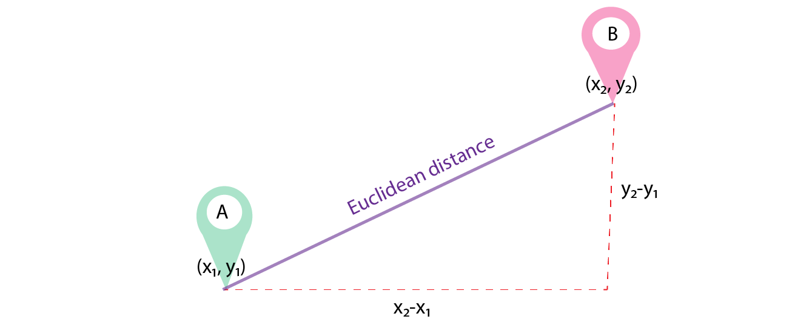

# CUSTOMIZATION

## Other algorithms
If you would like to implement a specific clustering algorithm, which is not covered by 
Blanket Clusterer, it should be easy to do this, by simply creating a new Python class, then 
extend the `GenericClustering.py` class and implement the method `clusterize_cluster(cluster)`.

All other methods should remain the same, unless you require further modification.

## Distance metric
All clustering algorithms use a metric with which they define the similarities between
entities, `K-Means` and `Agglomerative` are no different.

The default clustering metric is the **Euclidean distance** formula, 
which works similarly to measuring the distance between two points on a piece of paper.



Based on our needs, we concluded that this metric yields worse results, compared to 
**Cosine distance** formula. The Cosine distance formula measures the angle the vectors
take, based on the Origin and decides the similarity between the entities


Based on this fact, as well as the fact that Cosine Distance handles multidimensional data 
better than Euclidean Distance, lead to us using the Cosine Distance as a metric for our clustering.

This can be altered if you need to, by changing the metric in the implementation of the algorithms
in `KMeansClustering.py` and `AgglomerClustering.py`.

The specific line in the code which needs to be altered is :
```
kmeans = KMeansClusterer(self.n_clusters, distance=nltk.cluster.util.cosine_distance)
```
and
```
agglomerative = AgglomerativeClustering(n_clusters=self.n_clusters, affinity='cosine', linkage='complete')
```