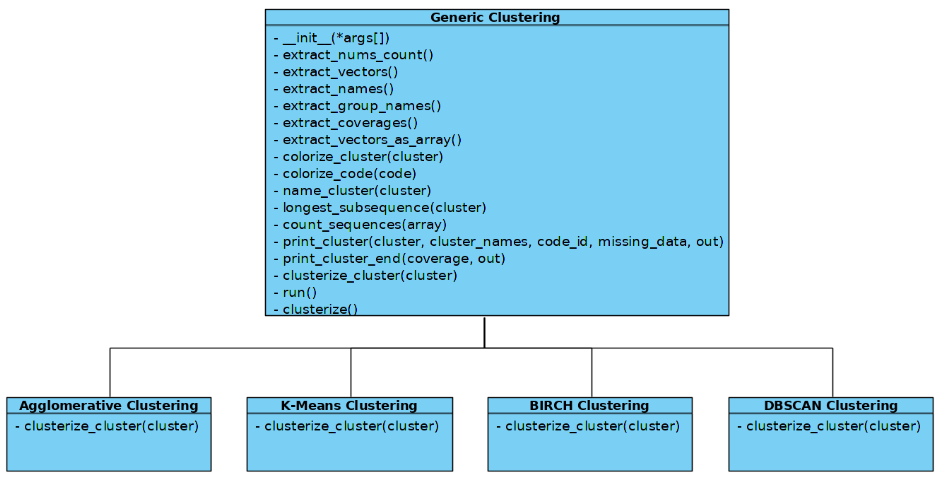
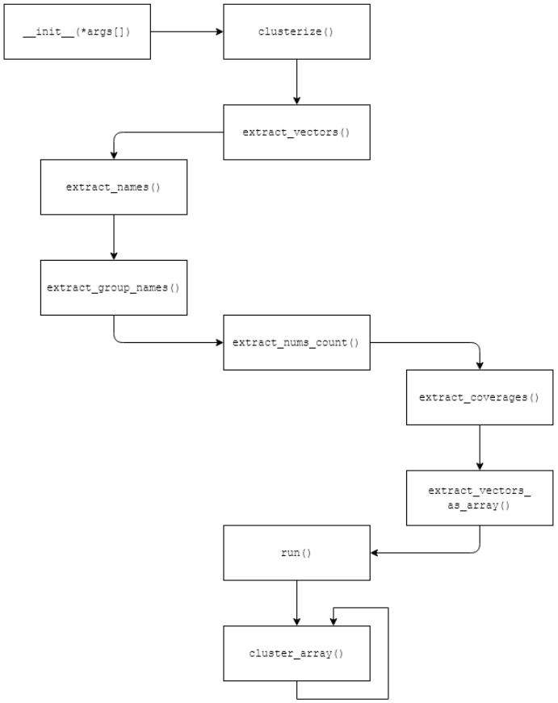

# HOW IT WORKS

If you fancy getting into the project, this page _might_ be useful for you.

## Architecture

The Python module is build upon already existing clustering algorithms, courtesy of 
[scikit-learn](https://scikit-learn.org/stable/) and [NLTK](https://www.nltk.org/).

The currently supported algorithms are K-Means, Agglomerative, BIRCH and DBSCAN, with more to come
in the future.

The implementation of the algorithms were divided into as many classes as there are algorithms, 
and all classes extend a main parent class `GenericClustering.py` which contains methods that are static
and used by all other clustering algorithms.



The execution steps are in the following image:


## Clustering

The methods have certain explanation in the code itself, so covering them here, is redundant.

The only method that needs a better explanation is the `clusterize_cluster(cluster)` method, which
is implemented in every clustering class.

```python
def clusterize_cluster(self, this_cluster):
        """
        Function used to clusterize a cluster
        Implement it for each clustering algorithm
        :param this_cluster:
            Cluster needed to be clusterized
        :return:
            Dictionary of new clusters
        """
        return None
```

The before-mentioned code segment is from the `GenericClustering.py` class, and is
implemented accordingly in each clustering algorithm.

This method is the main clustering method, which clusters the data with the certain
algorithm.

For example, the method in `AgglomerClustering.py` is here:

```python
 def clusterize_cluster(self, this_cluster):
        ...
        agglomerative = AgglomerativeClustering(n_clusters=self.n_clusters, affinity='cosine', linkage='complete')
        ...
```

With this line, we initialize the clustering variable which will cluster the data.

### Clustering algorithm

As well as choosing the algorithm, there needs to be a specific algorithm which the module will follow
to cluster the data. We developed a couple of checks which you can modify if you need/want to.

The algorithm decides how many children a certain cluster will have, and the calculation is as follows:

`N` - number of items in the cluster

`M` - number of items defined by the user to be in the cluster
```
1. clusters = clusterize_cluster(data)

2. for each cluster in clusters:
    if N > M then:
        if N > M*M then:
            new_clusters = clusterize_cluster(cluster)
            goto 2. with each cluster in new_clusters
        else:
            cluster data with N/M elements in cluster
    else:
        don't cluster the data
```

The module follows this algorithm to cluster your data. Other than this algorithm, we need
to explain the naming algorithm, which defines the names of the clusters.

### Naming algorithm

In this segment, we will explain the naming algorithm which the module uses to generate the name
for the cluster.

```
name_cluster(cluster):
    if group_names_path is present:
        number_of_entities_per_group = cluster.count_entities_by_group()
        sorted_entities = number_of_entities_per_group.sort_by_size()
        // sorted_entites is dictionary {id: group_name, count: number_of_entites}
        name = ""
        number_of_entites_covered = 0
        for entry in sorted_entities:
            if number_of_entites_covered % cluster.size > 60: // 60% of entities are covered
                return name
            name += entry.description
            number_of_entities_covered = entry.number_of_entities
    else:
        all_descriptions = ""
        for entity in cluster:
            all_descriptions += entity.description
        find_most_common_words = Rake.extract_keywords_from_text(all_descriptions)
        return find_most_common_words[0..3]
```

Along with these methods, there are other methods that are used by the module which are not explained or mentioned in
this documentation. Because this is open-source, you, as a user, can easily modify any line of code you wish.