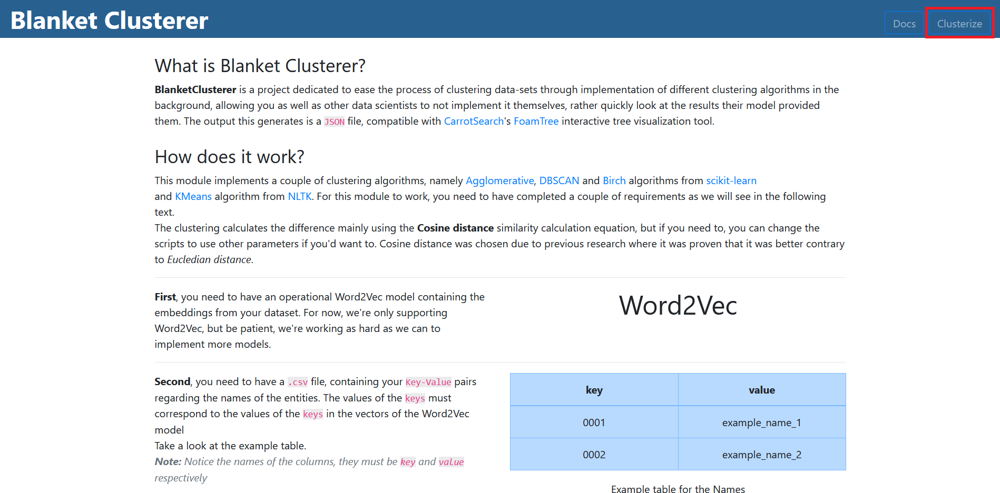
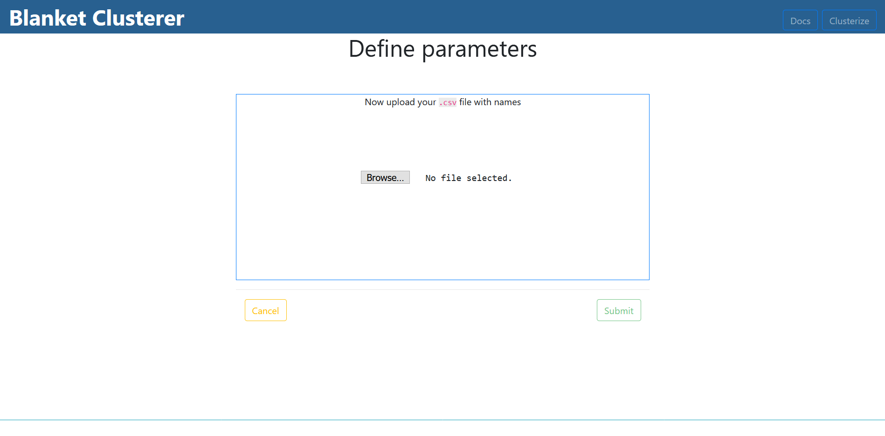
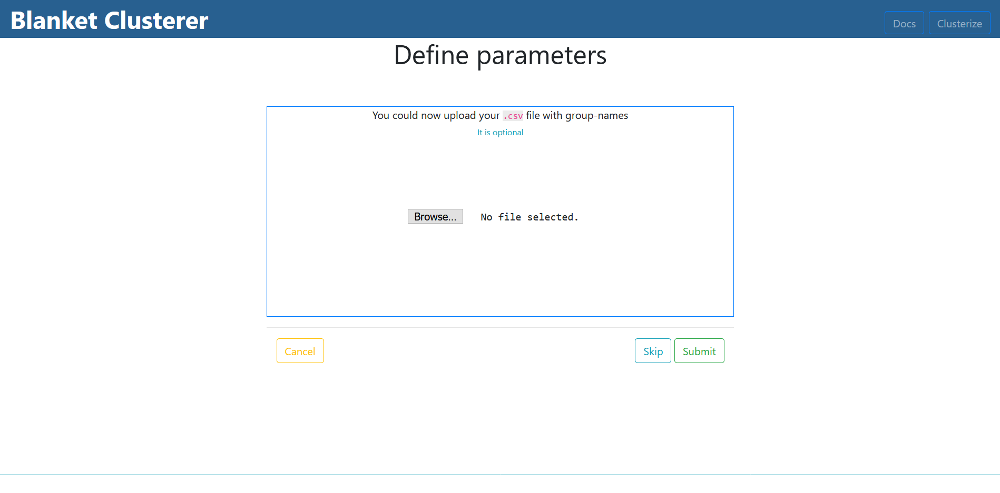
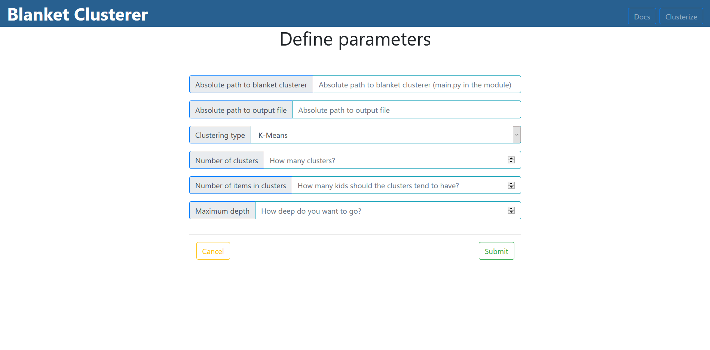
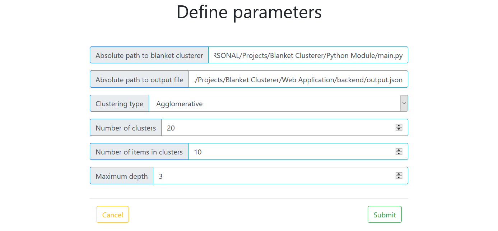
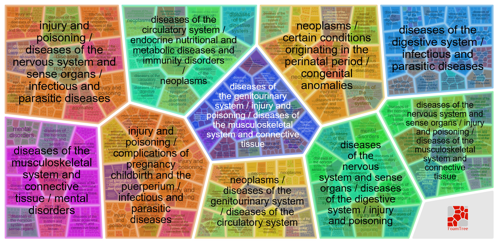
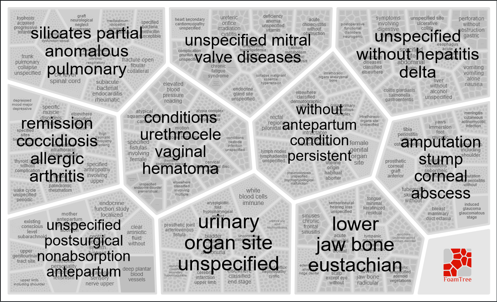

# USAGE

## Use through terminal

To use the module without using the GUI, you can just use the following command:

````shell script
  python blanket_clusterer_path model_type num_clusters embeddings_path names_path num_items max_depth output_path group_names_path
````

Arguments and descriptions:
<table>
    <thead>
        <tr>
            <th>
                Argument
            </th>
            <th>
                Description
            </th>
        </tr>
    </thead>
    <tbody>
        <tr>
            <td>
                <code>blanket_clusterer_path</code>
            </td>
            <td>
                Path to location of <code>main.py</code> in the module
            </td>
        </tr>
        <tr>
            <td>
                <code>model_type</code>
            </td>
            <td>
                Type of clustering algorithm (Supported values: <code>k-means</code>, <code>agglomerative</code>, <code>birch</code> and <code>dbscan</code>)
            </td>
        </tr>
        <tr>
            <td>
                <code>num_clusters</code>
            </td>
            <td>
                Number of clusters in a certain level of the hierarchy
            </td>
        </tr>
        <tr>
            <td>
                <code>embeddings_path</code>
            </td>
            <td>
                Absolute path to <code>Word2Vec</code> model
            </td>
        </tr>
        <tr>
            <td>
                <code>names_path</code>
            </td>
            <td>
                Absolute path to the names file (file must be in a specific format, check out [INSERT PAGE LINK])
            </td>
        </tr>
        <tr>
            <td>
                <code>num_items</code>
            </td>
            <td>
                Number of entities a cluster should have
            </td>
        </tr>
        <tr>
            <td>
                <code>max_depth</code>
            </td>
            <td>
                Maximum depth of hierarchy (Current maximum supported depth is 6)
            </td>
        </tr>
        <tr>
            <td>
                <code>output_path</code>
            </td>
            <td>
                Absolute path to the <code>output.json</code> file 
            </td>
        </tr>      
        <tr>
            <td>
                <code>group_names_path</code>
            </td>
            <td>
                Absolute path to the group names file (This file is <strong>optional</strong>, but provides better visualization. 
                The format needs to be the same as <code>names_path</code> file)
            </td>
        </tr> 
    </tbody>
</table>

**If any errors occur, you should be notified through the terminal.**

After successfully executing the shell command, you should see your `output.json` file, with the clustered results in it.

It should look something like the following example:
```json
{
  "id": "0",
  "label": "Example Parent 1",
  "coverage": "0.123",
  "groups": [
  {
    "id": "0.0",
    "label": "Example Child 1",
    "coverage": "0.123",
    "groups": [
    {
      "id": "0.0.0",
      "label": "Example Child 3",
      "coverage": "0.123"
    },
    {
      "id": "0.0.1",
      "label": "Example Child 4",
      "coverage": "0.123"
    }]  
  },
  {
    "id": "0.1",
    "label": "Example Child 2",
    "coverage": "0.123"
  }  
]
}
```

You might have noticed the `coverage` attribute. This attribute is used for the coloring part of the visualization and it is only
present if you have provided a `group_names_path` file.

## Use through GUI

**IMPORTANT: The Web Application (GUI) is the one that provides the 3D visualization. Without it, you can only view the `output.json` file**

After you have downloaded both the Python Module and the Web Application, and setup them according to [Getting Started](/getting-started/quick-start.md) 
you can easily cluster your data following these couple of steps.

### 1. Make sure your Web Application is running (both Flask and ReactJS)

Commands to start up the application: `npm start` for ReactJS and `flask run` for Flask.

Head over to `http://localhost:3000` to access the GUI

### 2. Head over to `Clusterize` on the GUI


### 3. Upload the `Word2Vec` model


### 4. Upload the `names` file


### 5. Upload the `group_names` file [_OPTIONAL_]


### 6. Define clustering parameters


> Check out our example for parameters
> 

### 7. Wait a bit while the process is executing

### 8. Check out the results

#### With Group names



#### Without Group names



## Use with Docker

To use Blanket Clusterer with Docker, refer to [Getting Started/Docker](/getting-started/docker.md)

## Format of files

The names and group-names files must be in a specific `.csv` format. The first column needs to be the key corresponding
to the value (name), and the second column needs to be the value itself.

For example:

```csv
1000,Example name0,
1001,Example name1,
...
9999,Example name9999
```

Alongside the file with the names, the file with the group names must also be in a specific format, similar to the file with the names.

For example:

```csv
1000-2000,Example group-name1,
2001-3000,Example group-name2,
...
```

**IMPORTANT: The keys in the files with names and group-names, must correspond with the key values of the vectors in the Word2Vec model!**